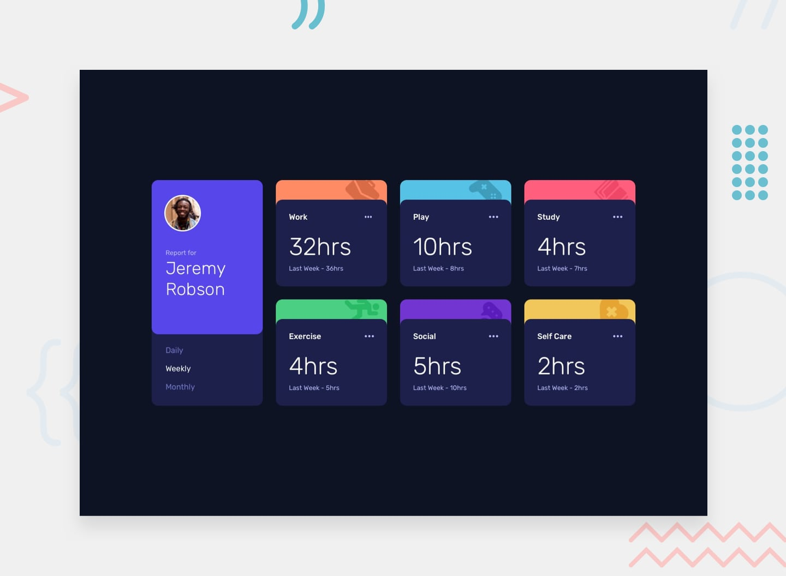

# Frontend Mentor - Time tracking dashboard

## Front-end Style Guide

### Layout

The designs were created to the following widths:

- Mobile: 375px
- Desktop: 1440px

> 💡 These are just the design sizes. Ensure content is responsive and meets WCAG requirements by testing the full range of screen sizes from 320px to large screens.

### Colors

 - white: hsl(0, 100%, 100%)
 - black: hsl(0, 0%, 0%)
 - navy-950: hsl(226, 43%, 10%)
 - navy-900: hsl(235, 46%, 20%)
 - navy-800: hsl(235, 41%, 34%)
 - navy-200: hsl(236, 100%, 87%)
 - purple-700: hsl(264, 64%, 52%)
 - purple-600: hsl(246, 80%, 60%)
 - purple-500: hsl(235, 45%, 61%)
 - orange: hsl(15, 100%, 70%)
 - blue: hsl(195, 74%, 62%)
 - pink: hsl(348, 100%, 68%)
 - yellow: hsl(43, 84%, 65%)
 - green: hsl(145, 58%, 55%)
 - grey-200: hsl(0, 0%, 85%)

#### Background

 - primary: navy-950
 - secondary-900: navy-900
 - secondary-800: navy-800

#### Typography

 - neutral-500: purple-500
 - neutral-200: navy-200
 - neutral-100: white

#### Highlight

 - accent-orange: clr-orange
 - accent-blue: clr-blue
 - accent-pink: clr-pink
 - accent-green: clr-green
 - accent-purple: clr-purple-700
 - accent-yellow: clr-yellow

### Typography

#### Body Copy

- Font size: 18px (card titles e.g. Work, Play)

#### Font

- Family: [Rubik](https://fonts.google.com/specimen/Rubik)
- Weights: 300, 400, 500